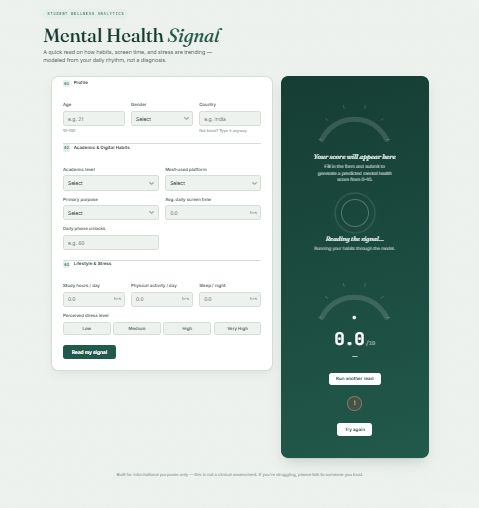

# 🧠 MindPulse AI — Student Mental Health Prediction Web App

[](YOUR_RENDER_LIVE_LINK_HERE)

**MindPulse AI** is a Machine Learning-powered full-stack web application that predicts a student's Mental Health Score based on their daily habits (sleep duration, study hours, social media usage, physical activity, etc.).

---

## 🌐 Live Demo & UI Preview

- **Live Application:** [Click Here to Access MindPulse AI](YOUR_RENDER_LIVE_LINK_HERE)

### 📸 Application Interface


_(Replace this placeholder with your actual UI screenshot path or link)_

---

## 🚀 Old Flow vs. New Flow (Project Evolution)

This project represents a major architectural upgrade in my Machine Learning engineering workflow towards production-ready standards:

| Feature / Step       | 🔴 Old Flow                   | 🟢 New Flow (Upgraded)                                                    |
| :------------------- | :---------------------------- | :------------------------------------------------------------------------ |
| **Deployment**       | Streamlit UI                  | **Render Web Service** (FastAPI Backend + HTML/JS Frontend)               |
| **Preprocessing**    | Manual Ad-hoc Transformations | **Scikit-learn `ColumnTransformer`** (Automated & Leak-free)              |
| **Model Training**   | Manual Loops & Ad-hoc Scripts | **Integrated ML Pipelines** (`Pipeline([('prep', ...), ('model', ...)])`) |
| **API & Validation** | Raw JSON / Basic Flask        | **FastAPI + Pydantic Schema Validation**                                  |
| **Frontend**         | Default Streamlit UI          | **Custom UI** (Vanilla HTML5, Modern CSS, JavaScript Fetch API)           |

---

## 🔮 Future Integration Plan (Upgrading Legacy Projects)

Through this project, I have mastered end-to-end production ML pipelines and modular deployment strategies. **Going forward, I will retrofit and upgrade all my legacy ML and Deep Learning (DL) projects with these same features:**

- ⚙️ **End-to-End Pipelines:** Transitioning manual preprocessing and model fitting into unified Scikit-learn pipelines.
- ⚡ **FastAPI Migration:** Replacing legacy Streamlit / Flask endpoints with fast, asynchronous, and modular FastAPI backends.
- 🛡️ **Pydantic Validation & Security:** Implementing strict schema validation, robust error handling, and environment-driven configurations (`.env`) to securely manage API keys and backend endpoints.

---

## 🛠️ Project Architecture & Tech Stack

1. **Machine Learning Pipeline (`notebook.ipynb`)**:
   - Data cleaning, log transformations, and outlier treatment.
   - Categorical feature encoding and scaling via `ColumnTransformer`.
   - Model selection & evaluation: Linear Regression vs. Random Forest (Default & Tuned).
   - Pipeline serialization using `joblib`.

2. **Backend API (`main.py`)**:
   - **FastAPI**: Asynchronous and high-performance Web API framework.
   - **Pydantic**: Input schema validation with field-level constraints (`age`, `study_hours`, `stress_level`, etc.).
   - **CORS Middleware**: Safe cross-origin request handling.

3. **Frontend (`index.html`, `script.js`, `style.css`)**:
   - Interactive gauge dashboard for visual score representation.
   - Dynamic error handling for both client-side and server-side validation.

---

## 📊 Model Performance Metrics

| Model                       | Test $R^2$ | Training $R^2$ | MAE        | RMSE       |
| :-------------------------- | :--------- | :------------- | :--------- | :--------- |
| **Linear Regression**       | 0.7397     | 0.7236         | 0.5361     | 0.6760     |
| **Random Forest (Default)** | 0.8775     | 0.9808         | 0.3472     | 0.4636     |
| **Random Forest (Tuned)**   | **0.8650** | **0.9547**     | **0.3689** | **0.4869** |

---

## 📂 Repository Directory Structure

```text
.
├── Mental_Health_Model.pkl           # Trained Keras Artificial Neural Network (ANN) model
├── notebook.ipynb                    # Jupyter Notebook (EDA, Preprocessing, ANN Training)
├── scaler.pkl                        # StandardScaler object for input normalization
├── columns.pkl                       # List of input features for ANN model
├── Student_Social_Media             # Dataset containing audio/speech acoustic features
├── UI.png                            # UI Screenshot
├── requirements.txt                  # Python dependencies
├── style.css                         # CSS for Streamlit frontend
├── script.js                         # JavaScript for Streamlit frontend
└── index.html                        # Streamlit frontend
```

MindPulse AI: A production-grade ML web app predicting student mental health scores based on daily lifestyle habits. Features an upgraded workflow: Scikit-learn Pipeline &amp; ColumnTransformer for leak-free training, FastAPI + Pydantic for schema validation, and an interactive HTML/JS frontend live deployed on Render.
